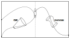

# TrajOpt

<p align="center">
  
</p>

TrajOpt is a self-contained Python library for multi-segment trajectory optimization using Sequential Convex Programming (SCP). It is designed around reusable __models__, configurable __missions__, and modular __methods__, with built-in support for entry, descent, and landing (EDL) and other aerospace applications. This structure makes it straightforward to define new problems, implement new algorithms, and compare solution methods within a common software pipeline.

## Features
* __Configurable Missions__: Configuring missions using existing models is fast and efficient due to the config.yaml structure.
* __Simple Model Design Framework__: Building new models only requires providing their continuous-time functions f_k(x, u, t, params, fcns).
* __Robust Base Algorithm__: The base AutoSCvx algorithm includes autotuning of penalty weights and second-order information for robust convergence on most problems with minimal hyperparameter tuning.
* __Self Contained__: The base algorithm for solving the nonconvex problems is fully written in this package. The only black-boxes we accept are calls to the convex solvers due to their guaranteed reliability and provable convergence.
* __Easy Algorithm Design__: Researchers can quickly design their own algorithms using the powerful modeling languages [CVXPY](https://www.cvxpy.org) and [JAX](https://github.com/jax-ml/jax).


## Installation

TrajOpt requires Python 3.11 or later.

Install the latest release from PyPI:

```bash
python -m pip install trajopt
```

For development, install from a local clone:

```bash
git clone https://github.com/mceowen/trajopt.git
cd trajopt
python -m pip install -e ".[dev]"
```

To include documentation dependencies:

```bash
python -m pip install -e ".[dev,docs]"
```

## Segments
A trajectory __segment__ is defined by a set of (Costs, Constraints, Parameters, Functions):

```math
\begin{aligned}
J_i &= \sum_j \int_{t_{I,i}}^{t_{F,i}} 
J_{r,j}(x_i,u_i,t,\mathrm{params}_i,\mathrm{fcns}_i)\,dt 
+ \sum_j J_{F,j}\!\left(
x_i(t_{F,i}),u_i(t_{F,i}),t_{F,i},
\mathrm{params}_i,\mathrm{fcns}_i
\right) \\
\mathbb{C}_i 
&= \left\{
(x_i(\cdot),u_i(\cdot),t_{I,i},t_{F,i})
\;\middle|\;
\begin{aligned}
x_i(t_{I,i}) &= x_{I,i}, \\
x_i(t_{F,i}) &= x_{F,i}, \\
\dot{x}_i &= f_i(x_i,u_i,t_i,\mathrm{params}_i,\mathrm{fcns}_i), \\
lb_{g,i} &\le g_i(x_i,u_i,t_i,\mathrm{params}_i,\mathrm{fcns}_i) \le ub_{g,i}, \\
lb_{g_{\mathrm{cvx}},i} &\le g_{\mathrm{cvx},i}(x_i,u_i,t_i,\mathrm{params}_i,\mathrm{fcns}_i) 
\le ub_{g_{\mathrm{cvx}},i}
\end{aligned}
\right\}. \\
\mathrm{params}_i 
&= \text{a set of user-defined variables} \\
\mathrm{fcns}_i 
&= \text{a set of user-defined functions of the form } 
f_k(x_i,u_i,t_i,\mathrm{params}_i,\mathrm{fcns}_i)
\end{aligned}
```

## Trajectory
The __trajectory__ optimal control problem (OCP) is defined by summing the cost contributions and enforcing the constraints from each __segment__:

```math
\begin{aligned}
\underset{\{x_i,u_i,t_{I,i},t_{F,i}\}_{i=1}^{N}}{\mathrm{minimize}} 
\quad & \sum_{i=1}^{N} J_i \\
\mathrm{subject\;to} 
\quad & (z_1,\ldots,z_N) \in \mathbb{C}, \\
\mathrm{where} 
\quad \mathbb{C} 
&= \mathbb{C}_1 \times \mathbb{C}_2 \times \cdots \times \mathbb{C}_N
\end{aligned}
```

## Augmented Optimal Control Problem

The OCP above is posed in continuous time with a free final time, which is not directly solvable. We transcribe it to a finite-dimensional problem using a __global normalized time__, a __time-dilation control__, and a __multiple-shooting__ discretization.

Time is normalized to $\tau \in [0,1]$ on a fixed mesh,

```math
0 = \tau_1 < \tau_2 < \cdots < \tau_N = 1,
```

and physical time is carried as a state through the time-dilation control $s(\tau) \triangleq \mathrm{d}t/\mathrm{d}\tau$. This lets us optimize the duration of each interval while keeping the mesh fixed. We collect the physical state and time into an __augmented state__, and the physical control and dilation into an __augmented control__:

```math
y \triangleq \begin{bmatrix} x \\ t \end{bmatrix}, 
\qquad 
\nu \triangleq \begin{bmatrix} u \\ s \end{bmatrix}.
```

The dynamics in normalized time follow from the chain rule:

```math
\frac{\mathrm{d}y}{\mathrm{d}\tau} = F(y,\nu) \triangleq 
\begin{bmatrix} s\, f(x,u,t,\mathrm{params},\mathrm{fcns}) \\ s \end{bmatrix}.
```

The augmented control is parameterized with a __first-order hold (FOH)__ between nodes, and continuity is enforced through __multiple-shooting defect constraints__,

```math
y_{k+1} - y_k - \int_{\tau_k}^{\tau_{k+1}} F\big(y(\tau),\nu(\tau)\big)\,\mathrm{d}\tau = 0, 
\qquad k = 1,\ldots,N-1,
```

while the nonconvex path constraints and boundary conditions are enforced at the nodes $\{y_k,\nu_k\}$. A free-final-time objective such as minimum time reduces to integrating the dilation, $\int_0^1 s(\tau)\,\mathrm{d}\tau$.

Stacking the nodal variables into a single decision vector $z = \{y_k,\nu_k\}_{k=1}^N$ yields the generic finite-dimensional __nonconvex__ program solved by the algorithm:

```math
\begin{aligned}
\underset{z \in \mathcal{Z}}{\mathrm{minimize}} \quad & J(z) \\
\mathrm{subject\;to} \quad & h(z) = 0, \\
                          & g(z) \le 0,
\end{aligned}
```

where $h(z)$ collects the dynamics defects, boundary conditions, and nonconvex equality path constraints; $g(z)$ collects the nonconvex inequality path constraints; and the convex state, control, and time-dilation sets are absorbed into $\mathcal{Z}$.

## Trajectory Analyzer

The `TrajectoryAnalyzer` is the top-level entry point. It reads a mission `config.yaml`, builds the `Trajectory` (its segments, costs, and constraints) and the `Method` that solves it, and exposes a simple `solve → analyze → plot` workflow:

```python
from trajopt.trajectory_analyzer import TrajectoryAnalyzer

traj = TrajectoryAnalyzer("config.yaml")
traj.solve()                 # run the SCP method
data = traj.analyze()        # propagate iterates through the nonlinear dynamics
traj.plot(data)              # re-dimensionalized plots
```

`analyze()` propagates each SCP iterate through the true nonlinear dynamics, re-dimensionalizes the result, and packages the data the plots consume. The analysis `type` set in the config selects what is run:

* __standalone__: solve and analyze a single mission.
* __mc__: Monte Carlo dispersion, re-solving while perturbing config values sampled per run.
* __method_variation__: solve the same mission with different method overrides and compare them.

## Method

A __method__ maps the nonconvex augmented OCP into a sequence of convex subproblems. The base algorithm is __AutoSCvx__: it relaxes the nonconvex constraints with __virtual buffers__ $(p,q)$ and penalizes them, so every subproblem stays feasible while violations are driven to zero:

```math
\begin{aligned}
\underset{z \in \mathcal{Z},\, p,\, q}{\mathrm{minimize}} \quad & 
J(z) + \tfrac{1}{2}p^\top W_h\, p + \tfrac{1}{2}q^\top W_g\, q + \lambda^\top p + \mu^\top q \\
\mathrm{subject\;to} \quad & h(z) = p, \\
                          & g(z) \le q, \quad q \ge 0.
\end{aligned}
```

The quadratic weights $(W_h, W_g)$ and the dual (linear) weights $(\lambda,\mu)$ are __auto-tuned__ through primal–dual updates, which removes most of the manual penalty-weight tuning that SCP methods typically require. The `Method` assembles a single CVXPY subproblem from all segments and solves it repeatedly through the SCP loop.

## Sequential Convex Programming

SCP solves the nonconvex problem by iterating on convex approximations built around the current reference trajectory $\bar z$. Each nonlinear mapping $c$ is replaced by its first-order linearization,

```math
\ell_c(z,\bar z) \triangleq c(\bar z) + \left.\frac{\partial c}{\partial z}\right|_{\bar z}(z - \bar z).
```

Starting from an initial guess, each iteration:

1. __Discretize & linearize__ the dynamics and constraints about $\bar z$.
2. __Solve__ the resulting convex subproblem for a candidate step.
3. __Line search__ on a merit function to accept a step length $\alpha$.
4. __Update__ the reference, the virtual buffers, and the penalty weights $(W_h, W_g, \lambda, \mu)$.
5. __Test convergence__ on the state change and constraint/defect residuals; otherwise repeat.

On convergence the buffers vanish, so the converged solution satisfies the original nonconvex problem to tolerance.

## Core Developers

Skye Mceowen and Carlos Morales


## Research Origins and Acknowledgements

TrajOpt development began as part of Skye Mceowen's PhD thesis research on sequential convex trajectory optimization, with early MATLAB prototypes developed in [`entry_opt`](https://github.com/mceowen/entry_opt), [`scp_sandbox`](https://github.com/mceowen/scp_sandbox), and [`trajopt_toolkit`](https://github.com/mceowen/trajopt_toolkit). The current Python package was then developed collaboratively by Skye Mceowen and Carlos Morales into a reusable framework for multi-segment trajectory optimization and algorithm design. The package and earlier prototypes form part of the software contributions of the PhD work.

Additional contributors to the current Python package include Pranav Ramasahayam, Daniel J. Calderone, and Samet Uzun. Earlier development and MATLAB prototypes also benefited from contributions by Jimmy Fowler, Edgerton Cook, Fabio Spada, Jason Zhou, Aman Tiwary, and Chris Sota.

The methods in TrajOpt build on the AutoSCvx thesis work and incorporate ideas from related advances in second-order trust-region modeling, continuous-time successive convexification, broader successive-convexification methods, state-triggered constraints, and temporal/logical specification handling.

### Method References

* __AutoSCvx (auto-tuned primal-dual successive convexification)__:  
  Mceowen et al., [“Autotuned Primal–Dual Successive Convexification for Reentry Guidance”](https://doi.org/10.2514/1.G008692), Journal of Guidance, Control, and Dynamics, 2025.  
  Mceowen et al., [“Auto-Tuned Primal-Dual Successive Convexification for Hypersonic Reentry Guidance”](https://doi.org/10.2514/6.2025-1317), AIAA SCITECH 2025 Forum.  
  Mceowen et al., [“Auto-Tuned Primal-Dual Successive Convexification for Powered Descent Guidance”](https://doi.org/10.2514/6.2026-0972), AIAA SCITECH 2026 Forum.  
  Mceowen et al., [“Auto-Tuned Successive Convexification for Entry Guidance With Continuous-Time Constraint Satisfaction”](https://doi.org/10.2514/6.2026-0971), AIAA SCITECH 2026 Forum.

* __CT-SCvx (continuous-time successive convexification)__:  
  Elango et al., [“Continuous-time Successive Convexification for Constrained Trajectory Optimization”](https://doi.org/10.1016/j.automatica.2025.112464), Automatica, 2025.

* __SCvx + STCs (successive convexification with state-triggered constraints)__:  
  Szmuk et al., [“Successive Convexification for Real-Time Six-Degree-of-Freedom Powered Descent Guidance with State-Triggered Constraints”](https://doi.org/10.2514/1.G004549), Journal of Guidance, Control, and Dynamics, 2020.

* __PS-SCP (pseudospectral sequential convex programming)__:  
  Sagliano et al., [“Six-Degrees-of-Freedom Aero-Propulsive Entry Trajectory Optimization”](https://doi.org/10.2514/6.2024-1171), AIAA SCITECH 2024 Forum.

* __STL + GMSR (signal temporal logic with generalized-mean smooth robustness)__:  
  Uzun et al., [“Optimization with Temporal and Logical Specifications via Generalized Mean-based Smooth Robustness Measures”](https://arxiv.org/abs/2405.10996), arXiv, 2024.
